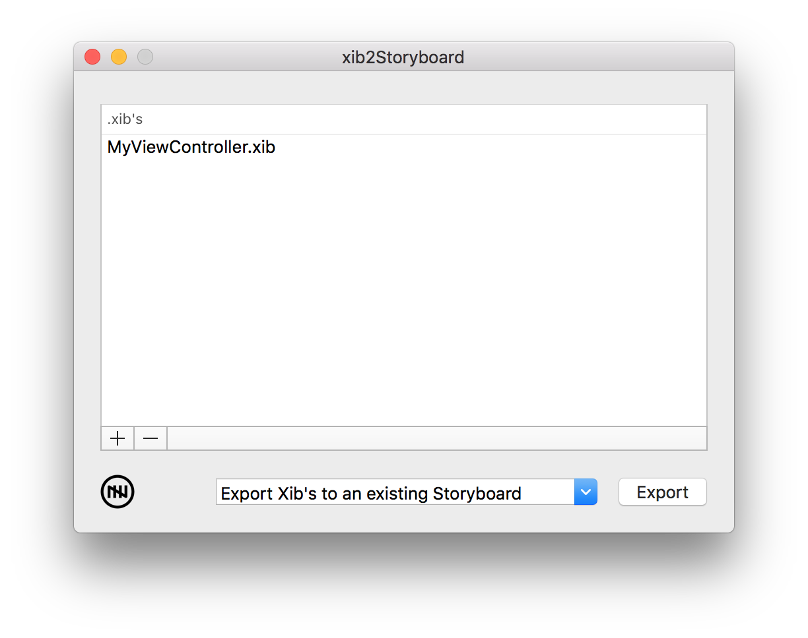
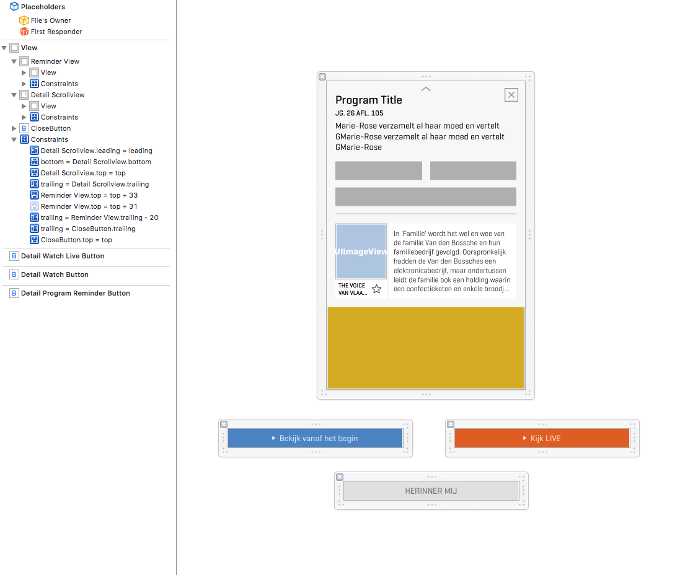
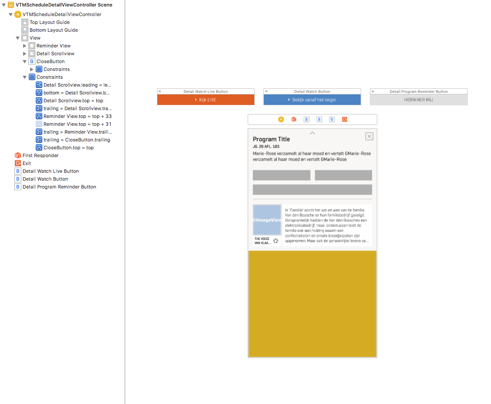

# xib2Storyboard • 

xib2Storyboard is a handy tool to easily convert .xib files to .storyboard without the hassle of manually copying views, losing your outlets and possibly constraints in the process.

- Maintain all outlets, outlet collections & constraints
- Maintain all other objects such as additional views or gesture recognizers
- Adds prototype cells to UITableViews

## Getting started

To run xib2Storyboard download this repo on macOS and run the xib2Storyboard.app file which is always the latest release. If you'd like to play around with the code yourself, build & run the Xcode project.

#### Prerequisites

- xib2Storyboard requires macOS 10.11 El-Capitan or higher.

#### How to use

1. Build & run the Xcode project (or run xib2Storyboard.app).
2. Add view controller .xib file(s) by using the '+' button or dragging the files on the window.
3. Select one of the export options from the dropdown menu.
5. Import the newly generated .storyboard files in your Xcode project.

Before (.xib):

After (.storyboard):

## Stability

This software is considered **Beta**.
It has been thoroughly tested internally at November Five but not yet used in any live products.

## Roadmap

Currently the following releases are planned:

#### xib2Storyboard 1.0.0 (TBD)

- Support for macOS Interface Builder Files
- Convert a .storyboard to multipe .storyboard's
- Convert a .storyboard to one or multiple .xib's

## Additional notes

xib2Storyboard was created by comparing the XML format of Interface Builder files. It may stop working for future versions of Xcode should Apple decide to change the XML format of .xib or .storyboard files. xib2Storyboard works and was tested using the Xcode 8 and Xcode 9 file formats. xib2Storyboard will be thoroughly tested when new beta versions of Xcode become available.

## Contact

This project is maintained by [Dries Van Schevensteen](https://github.com/driesVS)

Got any questions or ideas? We'd love to hear from you. Check out our [contributing guidelines](CONTRIBUTING.md) for ways to offer feedback and contribute.

## License

Copyright (c) [November Five BVBA](https://novemberfive.co). All rights reserved.

Licensed under the [MIT](LICENSE.txt) License.
